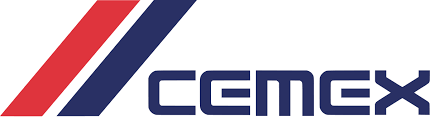

PlanXGo
=============

|

.. admonition:: Business Opportunity

   Reduce cost and improve sustainability efforts for large-scale vehicle logistics planning

The vehicle routing problem of optimally finding routes for multiple vehicles across a set of locations is a
common logistics challenge for many companies.  The are a number of variables that need to be accounted for in any
solution including capacity constraints on the vehicles and the time windows for visiting each location.  This solution
had a number of additional constraints and needed to be deployed as an API so that it could be run on demand.

Project Goals
----------------

1. Reduce fright cost (Fuel) by shortening the travel distance
2. Reducing the integral costs by picking up the cheapest material available along the optimal route
3. Optimize plant capacity
4. Ensure punctuality
5. Reduce CO2 emissions

Tech Stack
--------------

.. figure:: ../images/azure.png
   :scale: 35%
   :align: center
   :alt: neoris-logo
   :figclass: align-center

|

Docker, Kubernetes, Comos DB

Resources
-------------------

- `Solution Presentation <https://neoris0-my.sharepoint.com/:p:/g/personal/nir_kaldero_neoris_com/EYJC60lcF4ZCopXOuKxM9oAB-W4Md6Fe7-Me2I-jl7OpMQ?e=70OUQI>`_
